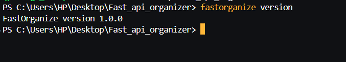
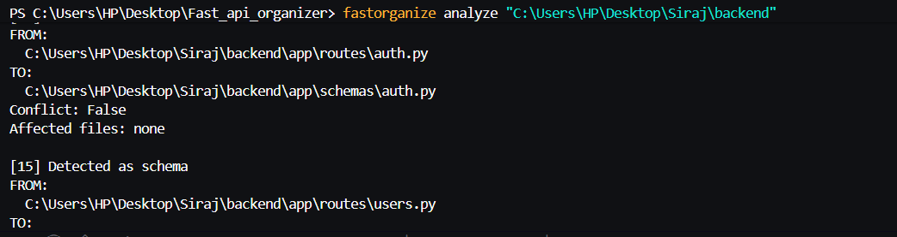
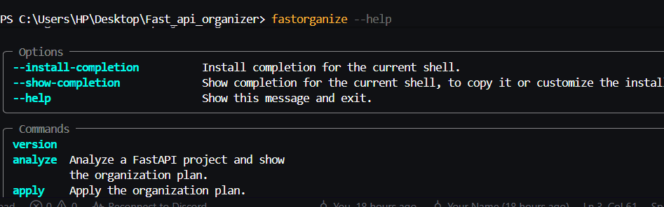

# FastOrganize

> An AST-powered CLI for safely organizing FastAPI projects.

FastOrganize analyzes a FastAPI project, detects the role of Python files,
analyzes dependencies, creates an organization plan, and safely applies
the required changes.

##  Features

-  FastAPI project scanning
-  AST-based Python analysis
-  Automatic file classification
-  Dependency graph analysis
-  Organization planning
-  Import rewriting
-  Safe file execution
-  Validation
-  Rollback support
-  Command-line interface
-  Python package distribution

##  Architecture

```text
                    FastOrganize
                         │
                         ▼
                    Project Scanner
                         │
                         ▼
                    AST Analyzer
                         │
                         ▼
                    File Classifier
                         │
                         ▼
                  Dependency Resolver
                         │
                         ▼
                  Organization Planner
                         │
                         ▼
                       Executor
                         │
                         ▼
                     Validator
                         │
                 ┌───────┴───────┐
                 ▼               ▼
              Success         Rollback
```
#Project Structure:
  fastorganize/
├── analyzer.py
├── classifier.py
├── cli.py
├── executor.py
├── pipeline.py
├── planner.py
├── resolver.py
├── scanner.py
├── validator.py
└── ...
#Installation :
git clone <your-repository-url>
cd Fast_api_organizer

pip install .
Development installation
pip install -e .
# Usage :
  # Analyze a FastAPI project:
   fastorganize analyze path/to/project
  # Apply the organization plan:
   fastorganize apply path/to/project
  # Check the version :
   fastorganize version

# How It Works :
  # FastOrganize uses Python's Abstract Syntax Tree (AST) to inspect source
files without executing them.

The analysis pipeline is:
 Scan
 ↓
Parse AST
 ↓
Detect classes/functions/imports/routes
 ↓
Classify files
 ↓
Build dependency graph
 ↓
Create organization plan
 ↓
Execute changes
 ↓
Validate

# Safety :
FastOrganize is designed to avoid blindly moving files.

Before changes are applied, the tool creates an organization plan.

The execution stage can then:

Determine affected files
Move files
Rewrite imports
Validate Python files
Roll back when necessary

# Technologies :
 Python
FastAPI
AST
Typer
pathlib
Git / GitHub
GitHub Actions

# Project Status :
 Version: 1.0.0

FastOrganize is currently distributed as a Python package and has been
tested through TestPyPI.

# Roadmap
 Project scanner
 AST analyzer
 File classifier
 Dependency resolver
 Organization planner
 Executor
 Validator
 CLI
 Python package
 Version 1.0.0
 TestPyPI release
 Automated test suite
 Production PyPI release
 More FastAPI project patterns
 Improved dry-run interface
## 🎬 Demo





